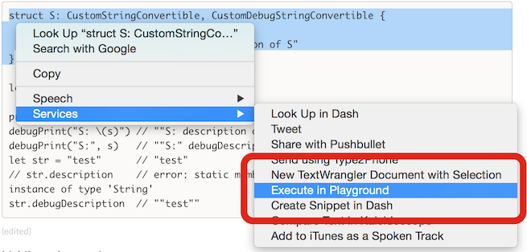

# PlayNow.app
[](LICENSE)

PlayNow.app is inspired by [PlayNow](https://github.com/apalancat/PlayNow)

## Features
- Create date-based named Playground and open it by Xcode
- Add time-based named Pages to Playground
- Detect unused Pages and remove them on opening Playground.
*(modified time - birth time) < 2sec ? unused : used*
- Add "Execute in Playground" menu item on Services menu

## Requirements
- OS X 10.10.5 or later
- Xcode 7 or later

## Installation
1. Download [PlayNow-0.2.1.zip](http://github.com/norio-nomura/PlayNow/releases/download/0.2.1/PlayNow-0.2.1.zip) (2015/09/25 updated)
2. Unzip it
3. Move `PlayNow.app` to `/Applications` folder

## Usage
Launch `PlayNow.app`
or
Select text on some app, click Menu > Services > "Execute in Playground"


## Configuration
Change location of Playground:
```sh
defaults write io.github.norio-nomura.PlayNow defaultDirectory /Users/norio/Documents
```

key                           | default     | note
------------------------------|-------------|-------------------------------
`defaultDirectory`            | `~/Desktop` |
`targetPlatform`              | `osx`       | `osx` or `ios`
`playgroundNamePrefix`        | `PlayNow-`  |
`playgroundNameDateFormat`    | `yyyyMMdd`  |
`pageNamePrefix`              |             |
`pageNameDateFormat`          | `HHmmss`    |
`makeUsedIfFromServices`      | `YES`       | add 3sec to modified time.
`XcodePath`                   |             | e.g. `/Applications/Xcode.app`

## Author

Norio Nomura

## License

PlayNow.app is available under the MIT license. See the [LICENSE](LICENSE) file for more info.
